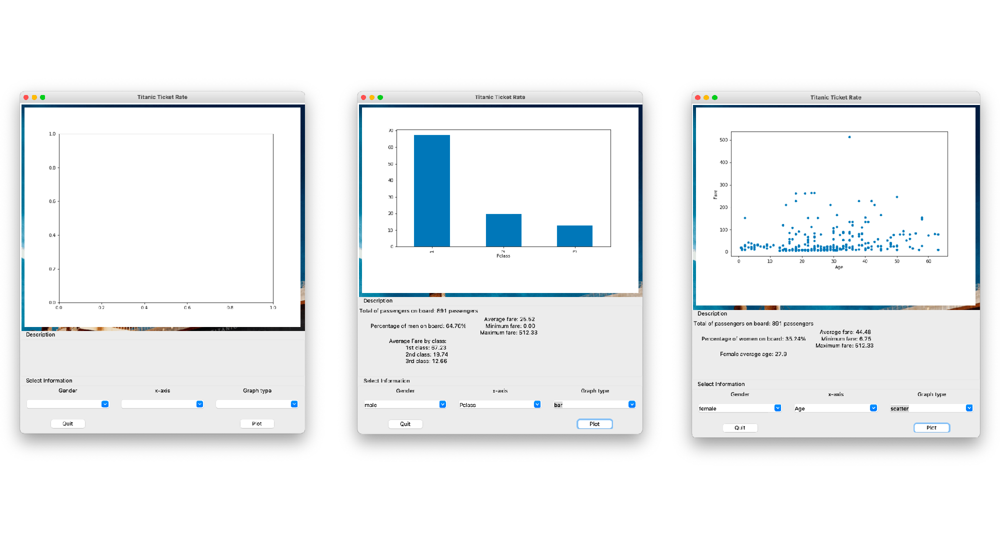

# Titanic Ticket Rate
 
## Description
This application will allow user to see the graph of ticket rate or fare on Titanic. The user can choose gender, then whether they want to know the rate describe by class or age.

[link to my demonstration video.](https://youtu.be/75QHi4yPIZw)
 
## Running the Application
You need to have matplotlib, tkinter, pandas to run the program. In order to open the application, you have to run through 'main.py'
 
## Design

 
## Design Patterns Used
This application use 2 design pattern which are state and template. Both are use in graph.py for plotting the graph.
